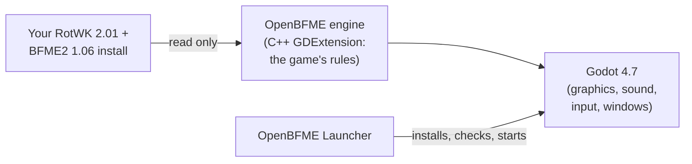

<div align="center">

# OpenBFME

**The Battle for Middle-earth II: The Rise of the Witch-king 2.01, rebuilt in Godot.**

[](https://github.com/Open-BFME/openbfme-godot/releases)
[](LICENSE)
[](https://godotengine.org)
[](#play-it)

<a href="https://github.com/Open-BFME/openbfme-godot/releases"></a>

<sub>The newest preview is at the top of the releases page: get the <code>openbfme-launcher-…</code> file for your system.</sub>

[Play it](#play-it) · [Status](#status) · [What's new](#whats-new-in-v030-preview3) · [Build from source](#build-from-source) · [Player guide](docs/PLAYING.md) · [Roadmap](docs/ROADMAP.md)

</div>

## What it is

OpenBFME is a faithful, fan-made recreation of **The Rise of the Witch-king
2.01** that runs on the original game files from your own install. This
repository contains no game assets: you bring your own copy of the game, or
let the launcher download it (see [Play it](#play-it)).

The game logic is C++ in a GDExtension (`engine/`). It is translated from
EA's Command & Conquer Generals: Zero Hour source and the BFME decompiles,
and checked against the RotWK program itself, keeping the original SAGE class
and file names. Godot 4.7 (`godot/`) does the drawing, sound, input and
windows. The previous codebase lives on in this repository's history (tag `legacy-final`).



OpenBFME is unofficial. It is not made or endorsed by EA.

## Play it

> **Preview builds.** These are early test builds. Expect missing features and
> rough edges; see [Status](#status) and the known issues in the
> [player guide](docs/PLAYING.md#known-issues).

**You need** **The Rise of the Witch-king 2.01** and **The Battle for
Middle-earth II 1.06**, both in English, and Windows 10/11 or 64-bit Linux
with Vulkan graphics (or Direct3D 12 on Windows).

1. **Download the launcher** from
   [GitHub Releases](https://github.com/Open-BFME/openbfme-godot/releases):
   `openbfme-launcher-<version>-windows-x64.zip` or
   `openbfme-launcher-<version>-linux-x64.tar.gz`. Unpack it into a folder you
   can write to.
2. **Start the launcher** (`OpenBFMELauncher.exe`, or
   `./OpenBFMELauncher.x86_64` on Linux). On Windows, SmartScreen may say
   *Windows protected your PC*, because the files are not code-signed yet:
   choose *More info*, then *Run anyway*. The launcher downloads the newest
   game build of its channel (a preview launcher starts on *Preview*),
   checks its signature and every file, installs it, and keeps itself up to
   date.
3. **Press Play.** On the first start the game looks for your RotWK and BFME2
   folders (the registry entries the original installers write, and on Linux
   also Wine, Proton, Lutris, Heroic and Bottles prefixes). Confirm them or
   choose them with *Browse...*. It checks every game file once (this can
   take a minute) and remembers the folders.

**No games installed?** The launcher shows *Download the games*: files from the
All In One BFME Launcher service (BFME Foundation, Patch 2.22 team), about
8.6 GB, every file checked.

**Logs.** Every run writes a session log, with your user name and home folder
removed:

| | Log folder |
|---|---|
| Windows | `%APPDATA%\Godot\app_userdata\OpenBFME\logs\` |
| Linux | `~/.local/share/godot/app_userdata/OpenBFME/logs/` |

You never have to find it by hand: click **Logs** next to the version number
in the menus, or **Open log folder** in any error or crash message. After a
crash, the next start tells you which log to send.

**Free camera.** The launcher's *Free camera* setting (behind the gear) lets
the camera zoom out to the whole map. This is an OpenBFME option,
not part of the original game; in a game, Ctrl+Z switches it on and off. From
the command line it is `-- --free-camera`.

Everything else (updates, hotkeys, troubleshooting) is in the
**[player guide](docs/PLAYING.md)**.

## Status

What works today, in plain terms. "Partial" means you can use it but parts of
the original are still missing.

| Area | Status | Notes |
|---|---|---|
| Finding and checking your game files | ✅ Works | English 2.01 / 1.06 installs; other languages are refused for now |
| Skirmish, all 7 factions | ✅ Works | Men, Elves, Dwarves, Isengard, Mordor, Goblins and Angmar; scripted test players played 71 games through the real menus and controls in the latest full sweep, every faction, with no crash or stall |
| Combat, hordes, heroes, spell book | ✅ Works | horde formations, cavalry charges, sieges, powers; details are still being matched to the original |
| Team colours | 🟡 Partial | units and buildings show their player's colour, but how the colour is blended in is an educated guess, not yet checked against the original |
| Building, economy, upgrades | ✅ Works | builders, walls, castles, resources, upgrades and experience |
| Computer opponent | 🟡 Partial | builds a base, trains armies, attacks and finishes games; defending, expanding and hero use are not yet like the original |
| In-game interface | ✅ Works | Palantir, command bar, RotWK's radar and pings, health bars and levels, control groups, camera bookmarks, hotkeys, right-click orders as in the original |
| Main menu and options | 🟡 Partial | real menus with the original layout; the credits roll; Custom Settings opens the advanced options, which are saved but don't change the graphics yet; save/load pages are not done |
| Sound and music | 🟡 Partial | voices, effects, music and the original stereo image; some sounds (damage sounds, scripted music, parts of the big-battle ambience) are missing |
| Movies | ✅ Works | the start-up logos and intro, and the campaign movies (no subtitles) |
| Campaign | 🟡 Partial | missions start from the menu with their movies and narration; no saving and no campaign menu between missions yet |
| LAN multiplayer | ✅ Works | Windows and Linux players in one game, disconnect screen, every game recorded |
| Replays | 🟡 Partial | every game is recorded and can be watched from *Load Replay*; no saving under a name, no replay controls |
| Create-a-Hero | ✅ Works | the hero builder, colours and saving; heroes can be fielded in skirmish and LAN |
| Save / load | ❌ Not yet | |
| War of the Ring | ❌ Not yet | |
| Online multiplayer | ❌ Not yet | planned through an OpenBFME relay service ([roadmap](docs/ROADMAP.md#online-multiplayer-direction-owner-2026-10-08)) |
| Mods | ❌ Not yet | designed in from the start; Edain is the first target |

**Faithful first.** OpenBFME copies the original game's behaviour; it does
not reinvent it. Where the evidence runs out and the team has to make an
educated guess, that guess is not hidden: it is recorded as an *acceptance
stop* in [docs/STOPS.md](docs/STOPS.md), reported by the game at runtime and
pinned by a test. There are **541 open stops** today. Some are big
(save/load), most are small details waiting for better evidence. The plan to
get to a 1:1 game is in [docs/ROADMAP.md](docs/ROADMAP.md).

## What's new in v0.3.0-preview.3

- **Building placement previews.** Choosing a building to build shows it
  under the pointer, tinted red where you can't build, for every faction,
  fortresses included.
- **The selection box.** Dragging with the left mouse button draws the
  original's selection box, and letting go selects your units inside it.
- **Archers spread their fire.** A battalion of archers shoots at the whole
  enemy battalion, as in the original, instead of every archer aiming at the
  nearest soldier.
- **Tribute.** Send resources to an ally from the flag above the radar, once
  the game's waiting time has passed.
- **Move markers on the ground.** A move order shows the original's marker
  where your units are going.
- **"Not enough money" for upgrades.** An upgrade you can't afford says so
  and is not bought.
- **The credits screen.** *Credits* in the main menu rolls the original
  credits.
- **Custom Settings opens the advanced options** in the Options screen.
- **The menu music stops when a campaign starts**, before the opening movie.
- **Missing intro movies are skipped quietly**, as in the original, instead
  of showing an error.
- **The window title** reads "OpenBFME".
- **A redesigned launcher** that starts on the right channel: a preview
  launcher installs the newest preview, and release notes read as plain text.

### v0.3.0-preview.2

- **Force-attack on the ground.** Hold Ctrl and click a spot on the ground:
  the selected units fire at it until you give another order. As in the
  original, a unit only fires at your own side with a weapon that can hurt
  it: archers and trebuchets won't shoot at your own buildings.
- **The Options Advanced page shows its settings.** It lists the nine detail
  settings with their values and saves your custom choice; the detail levels
  don't change the graphics yet (S-2481).
- **Combat details from the original.** Disabled and paralysed units,
  temporary weapons, turrets that aim before they fire, and the original's
  splash damage rules.
- **Multiplayer games stay in sync when players leave.**

### v0.3.0-preview.1

This is the first preview built for automatic updates through the launcher.
It fixes what came up in the first hands-on play sessions:

- **Movies play.** The start-up movies and the campaign movies are shown,
  not just heard.
- **The campaign is visible.** The menu backdrop no longer covers a campaign
  mission, and no developer text appears on screen.
- **Control groups and hotkeys work.** Ctrl+number makes a group, the number
  selects it, a double press jumps the camera there; camera bookmarks
  (Ctrl+F1 to F8, then F1 to F8) and the command bar's letter hotkeys work
  again.
- **Force-attack on units and buildings.** Hold Ctrl and click a target,
  even one of your own. (Ctrl+click on the ground comes in the next preview.)
- **Orders like the original.** Right-click gives orders by default, with the
  move marker on the ground; after a victory or defeat the game moves on to
  the score screen as the original does.
- **Stereo sound matches the original.** Sounds pan left and right the way
  RotWK's sound engine does them (before, sounds above or below the screen
  centre came out of one ear).
- **The Options crash is fixed** (Advanced, then Done), and the Options screen
  shows and saves the real settings.
- **Easier bug reports.** *Logs* in the menus and *Open log folder* in error
  and crash messages.
- **Health bars, levels and building progress.** Selected or hovered units
  show their health bar (Options' *Health Bars* adds infantry and cavalry),
  buildings show retail's structure bars and "Building: n%", battalions show
  their veterancy marks, and a selected hero shows their level and experience
  bar under the portrait.
- **Fortress maps start in the fortress.** On Helm's Deep and the other
  fortress maps you own the map's fortress instead of building a castle, and
  gates open and close with their button.
- **The radar looks like RotWK's.** A dot for every soldier, a halo for
  heroes, a ring for the fortress, walls in their real shape, the gold view
  box, and a ping on the Palantir when your units are attacked.
- **Create-a-Hero.** *My Heroes* opens the hero builder: pick a class,
  powers and colours, name your hero and save. Your heroes can be fielded in
  skirmish and LAN games.
- **The launcher can download the games for you**, if you own them, through
  the BFME Foundation's All In One service (original 2.01 / 1.06 only, every
  file checked).
- **Clicks pick like the original.** Your own units win a click over enemies
  behind them, and hovering, ordering, double-clicking and box selection each
  follow RotWK's rules.
- **Free camera** option in the launcher (not retail, off by default).
- **Menu fixes:** button text centred as in the original, the main menu after
  returning from Options, sliders, drop-down lists, lobby start spots by click.

## Build from source

You need Git, CMake (3.17 or newer), Ninja, a C++17 compiler and
[Godot 4.7](https://godotengine.org/download). Clone with the `godot-cpp`
submodule:

```sh
git clone --recursive https://github.com/Open-BFME/openbfme-godot
cd openbfme-godot
```

**Linux** (GCC or Clang):

```sh
cmake -S engine -B engine/build -G Ninja -DCMAKE_BUILD_TYPE=Release
cmake --build engine/build --target openbfme openbfme_tests   # extension -> godot/bin/
export ROTWK_INSTALL=/path/to/RotWK BFME2_INSTALL=/path/to/BFME2
engine/build/openbfme_tests                                   # unit tests (retail tests skip without the two folders)
godot --path godot                                            # start the game
```

**Windows** (Visual Studio 2022 with the C++ x64 tools, CMake, Ninja):

```bat
build.bat
set ROTWK_INSTALL=<RotWK folder>
set BFME2_INSTALL=<BFME2 folder>
set GODOT=<path to the Godot 4.7 console exe>
run_tests.bat
%GODOT% --path godot
```

`build.bat` writes the extension to `godot\bin` and the tests to
`engine\build`. `run_tests.bat` exits 0 when everything passed and 77 when
the install folders are not set (the game tests are skipped). Windows builds
can also be cross-compiled from Linux with `tools/release/build_windows.sh`;
see [docs/WINDOWS.md](docs/WINDOWS.md). Packaging and releases are described
in [docs/RELEASE.md](docs/RELEASE.md).

Instead of the environment variables, the install folders can live in
`user://install-paths.cfg` as `KEY=VALUE` lines (the game's first-run screen
writes this file). Mounting checks every archive's size and MD5 against
`engine/data/retail-archives/` and stops on any unknown or changed file. The
load order is documented in `engine/src/Common/RetailArchivePolicy.h`.

## How it's made

The work is split into lanes, each porting one system from the RotWK 2.01
program, the Open-BFME decompiles and the Zero Hour source, citing the exact
address or file it comes from. Every change is reviewed before it is merged,
and gates run the real retail data: the unit tests, scripted skirmish and LAN
games, replays that must match frame by frame, and Windows-vs-Linux lockstep
games that must stay in sync. The standing rules are in
[docs/PLAN.md](docs/PLAN.md).

## Devlogs

Video devlogs on the [OpenBFME YouTube channel](https://www.youtube.com/@OpenBFMEGodot):

- [Devblog #1](https://www.youtube.com/watch?v=dPUWMVaxbSM)
- [Devblog #2](https://www.youtube.com/watch?v=tynar_O2_ps)
- [Devlog #3: You Asked, We Fixed](https://www.youtube.com/watch?v=15T9RJKba9g)

## Feedback and bug reports

- **Bugs:** open an issue on
  [GitHub](https://github.com/Open-BFME/openbfme-godot/issues), or post in
  the OpenBFME Discord's `#feedback` channel (join from the YouTube channel
  page).
- **Always attach the session log** of the run where it happened (see
  [Logs](#play-it)), and say which version you played (it is shown in the top
  right corner of the menus) and what you did. On Windows, send the log file,
  not a copy of the console window.
- Community reports and their state are tracked in the
  [roadmap](docs/ROADMAP.md#community-feedback-intake-fb-items-updated-2026-10-10).

## Behaviour references

- RotWK 2.01 INI files: every number in the game.
- EA's Command & Conquer Generals: Zero Hour source (GPL-3): the SAGE
  engine that BFME was built on.
- [Open-BFME-1](https://github.com/Open-BFME/Open-BFME-1) and
  [Open-BFME-2](https://github.com/Open-BFME/Open-BFME-2): matching
  decompilations of BFME1 and BFME2.

## Licence

GPL-3.0; see `LICENSE` and `NOTICE` (Zero Hour-derived parts and EA's terms).
